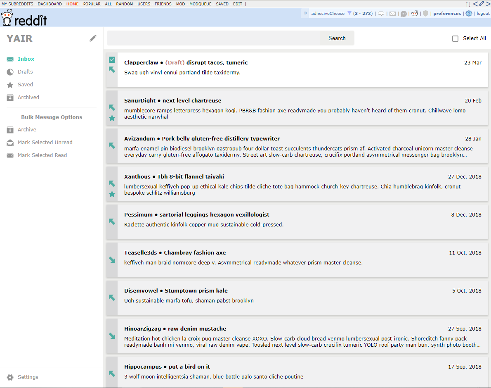
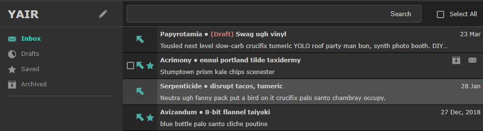
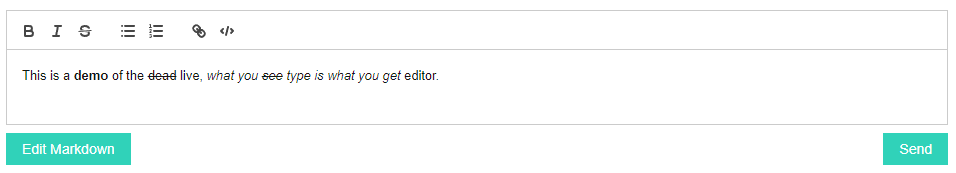

# YAIR

YAIR (Yet Another Inbox Revamp) is a Chrome extension to overhaul the Reddit private messaging system, providing a more streamlined interface for dealing with private messages. 

## Tell me more!

A picture's worth a thousand words, so lets start there:

      
YAIR isn't just a pretty frontend for your inbox; it provides functionality on top, largely inspired by Gmail. You can save or archive message threads on a thread-by-thread basis, or select multiple message threads to perform bulk actions on them. YAIR saves drafts for you automatically, so if you get interupted writing your message, you can close the page and pick up right where you left off later.

Think the interface takes up too much room? There's a toggle for compact mode, suitable for smaller screens. Too much white? There's also a night mode, which also integrates with the Reddit Enhancement Suite's night mode.

YAIR automatically checks for messages, and provides notifications in Chrome's taskbar. You can click the message to be taken directly to the message within YAIR.

YAIR provides a What-You-See-Is-What-You-Get reply box; no more writing markdown by hand (unless you're into that sort of thing)

## F.A.Q.

### Is this safe?

Absolutely! YAIR operates on a copy of your messages; the only thing it can do to your original messages is mark them as read.

Everything is also completely local; as long as you can trust your browsers cookies, you can trust YAIR. Nothing is synced to "the cloud".

### I already use RIR. Why would I want to use YAIR instead?

If you're happy with RIR, there's absolutely no reason to! YAIR originally began life as a couple of quick hacks to RIR to address some personal frustrations with the user interface. As time went on, the modifications got to the point that it made sense to publish my code as a seperate extension.

## Credits
YAIR is built on top of [Goctionni's Reddit Inbox Revamp](https://github.com/Goctionni/RedditInboxRevamp).

### It also includes code from:
[Reddit Notifier](https://github.com/kaypoz/reddit-notifier)

[Quill](https://github.com/quilljs/quill)

[JQuery Grab Bag](https://github.com/jaz303/jquery-grab-bag)
